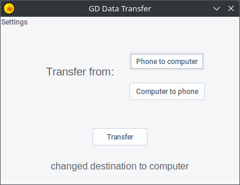

# GD Data Transfer
A tool to transfer your Geometry Dash save files, without having to save to RobTop's servers first.

# Why does this exist?
You see, back in ye olde times you used to be able to just save your data using the in-game 'Save' button, and then load it on another device.

But then 2.2 came out. And there's a lot more traffic on the servers, causing the save button to become very unreliable during peak hours. Unless you like gambling, that is.

When trying to save, most of the time you'll encounter this error message:

> Backup failed. Please try again later. Save size is within limits.

This was annoying enough to me that I made this. Now you can conveniently transfer your save data directly between your phone and computer, using the USB cable that comes with your charger.

# Before using it

**Enable USB Debugging:**
1. Go to Android settings, and select "About".
2. Tap on "Build number" seven times.
3. Go back. Then select "Developer options"
4. Scroll down, and check "USB debugging" under "Debugging".

Now plug your device into a computer. You'll receive a prompt asking if you want to authorize USB debugging for that computer. Check "always allow" and tap OK to confirm

> [!IMPORTANT]
> You need Geode to use this with a non-rooted Android device.
> The reason for this is that vanilla GD stores its save files in a root
> directory, while Geode doesn't.

# Download

You can download it [here](https://github.com/paradoxflux2/GD-data-transfer/releases)

# How does it work?

GDDT uses the ADB pull and push commands to transferboth save files to the destination. The save file folders are specified in the settings and you can change them as needed.

By default, GDDT also makes backups every time you transfer your save files, so that you can undo that transfer if you misclicked and lost some progress or something. The button to revert your last transfer can be found in the settings.

Only one backup for each save file is kept at a time, and those backups are overwritten with each transfer. This essentially means that you can only undo the most recent transfer.

